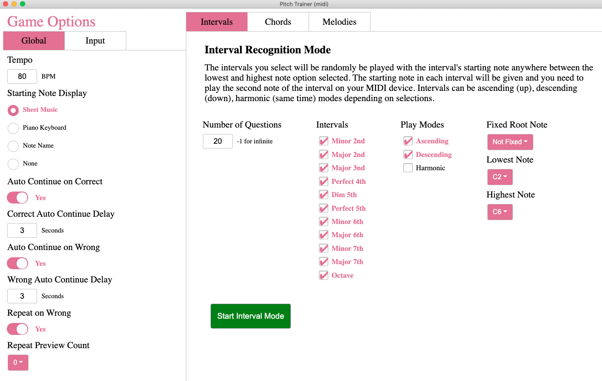
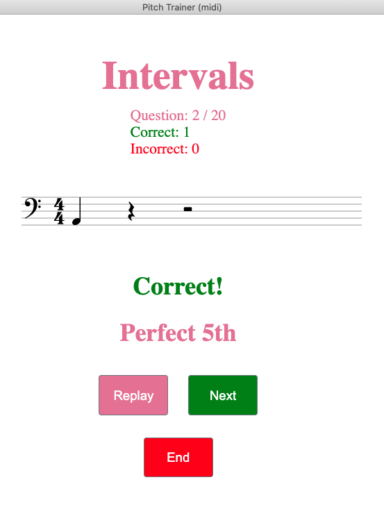

# Pitch Trainer (midi)

A highly configurable electronic app for relative pitch (ear) training.

Runs through a series of randomized interval, chord, or randomly generated melodies and prompts for matching playback from a MIDI (Piano keyboard) or microphone input device.

For intervals, frequency detection via a microphone can be used, but for chords and melodies game types, MIDI is preferred.

**Note:** Currently only frequency feedback for Interval mode is supported

## Demo

There are three different customizable game modes

Below is a ss from the Interval game mode

## Usage

1. Clone this repo, 
2. `npm install`
3. `npm start` to run the dev buil

Production build is not tested.

## Work in Progress (WIP!)

This was a two weekend MVP thrown together haphasardly and needs a lot of polish before it's done. Currently only intervals are supported, and option select is super laggy since everything is re-rendering on each input. The app is usable for Intervals, which is all I need atm.

Below is a list of TODO items before I'll consider this project "finished":

- MIDI Support: input and game mode feedback
- Fix slow option rendering
- Finish melodies game mode
- Finish chords game mode
- Fix bugs
- Add note-name starting note display opt implementation

Stretch-goal TODOs:

- Add Scales game mode
- Look into frequency chord identification 
- Cleanup / polish UI
- Build platform-agnostic executables 
- Clean reorg code. Folder structure and splitting up AppContext for starters.  

